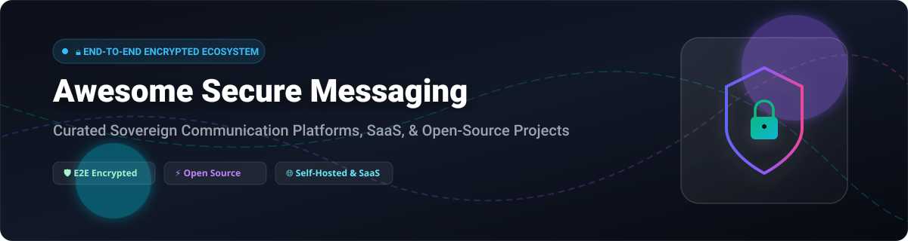

# Awesome Secure End-To-End Encrypted Messaging 🔒

   

## 🛡️ Top Secure End-to-End Encrypted Messaging Ecosystem

**Curated List of SaaS Products & Open-Source GitHub Projects**  
*Focused on End-to-End (E2E) Encryption, Self-Hosted Messaging, Zero-Knowledge Security & Sovereign Communication*  

**Last updated: October 2026** 📅

---

### 💡 Overview & Market Landscape

This repository tracks notable **commercial E2E encrypted messaging platforms** and **open-source projects** that protect communications with end-to-end encryption — ensuring only the sender and intended recipient can read messages, not the service provider, network operators, or unauthorized third parties.

#### 📊 Market Size & Sector Concentration
> 📈 The global secure messaging and enterprise encryption market is estimated at approximately **$11–$19 billion USD** (projected to surpass **$50–$70+ billion** over the next decade). Rather than a concentrated "winner-take-all" landscape, the sector is **moderately fragmented**, with top market leaders operating alongside specialized privacy-first and open-source cloud solutions.

---

## 📑 Table of Contents
- [🏢 SaaS/Hosted Platforms](#-saashosted-platforms)
- [⚡ Open-Source GitHub Projects](#-open-source-github-projects)
- [🛠️ E2E Encryption Libraries](#%EF%B8%8F-e2e-encryption-libraries)
- [🤝 How to Contribute](#-how-to-contribute)
- [💖 Support](#-support)
- [⚠️ Disclaimer](#%EF%B8%8F-disclaimer)
- [⭐ Star History](#-star-history)

---

## 🏢 SaaS/Hosted Platforms

The table below compares leading commercial and enterprise E2E encrypted messaging platforms, sorted by estimated company revenue/valuation in descending order:

| 🏢 Product | 💰 Starting Tier Price | 🎁 Free Tier Limit / Free Trial Details | 📊 Company Size (Revenue / Valuation) | 📝 Overview |
| :--- | :--- | :--- | :--- | :--- |
| **[Microsoft Teams](https://www.microsoft.com/microsoft-teams/)** 🔷 | **$4.00** / user / month (Essentials) | **Free Plan**: Unlimited 1-on-1 calls (up to 30 hours), group calls up to 60 mins & 100 participants | **$3.1+ Trillion** valuation / **$245B+** annual revenue (Microsoft Corp.) | Microsoft's enterprise collaboration suite. E2E encryption supported for 1-on-1 calls. |
| **[AWS Wickr](https://aws.amazon.com/wickr/)** ☁️ | **$5.00** / user / month (Standard) | **3-Month Free Trial**: Premium features for up to 30 users (50 users for WickrGov) | **$2.0+ Trillion** valuation / **$600B+** annual revenue (Amazon / AWS) | AWS's enterprise E2E encrypted platform with strict administrative and compliance controls. |
| **[Slack Enterprise Grid](https://slack.com/)** 💬 | **$7.25** / user / month (Pro plan starting tier) | **Free Plan**: Unlimited channels, 90-day message history limit, 10 integrations | **$27.7 Billion** acquisition / **$37B+** annual revenue (Salesforce) | Popular workspace chat platform. E2E encryption available for Slack Connect DMs (opt-in). |
| **[Mattermost](https://mattermost.com/)** 🚀 | **$10.00** / user / month (Professional) | **Free Forever Plan**: Self-hosted Free Edition (unlimited users & search history) | **$100M+** ARR estimated / **$250M+** valuation | Open-source enterprise collaboration suite with E2E encryption available via plugins. |
| **[Symphony](https://symphony.com/)** 🏛️ | **$20.00** / user / month (Standard tier) | **30-Day Free Trial**: Full access for financial team evaluation | **$1.4 Billion** valuation / **$100M+** annual revenue | Secure E2E encrypted communication tailored for financial institutions and compliance. |
| **[Element (Matrix)](https://element.io/)** 🌐 | **$5.00** / user / month (Element One / Business) | **Free Plan**: Free Matrix account on public server (matrix.org) with default E2E encryption | **$30M+** total funding / **$15M+** revenue (New Vector / Element) | Secure federated messaging on the Matrix protocol. E2E encrypted by default with cross-signing. |
| **[NetSfere](https://www.netsfere.com/)** 🔒 | **$5.00** / user / month (Enterprise starting tier) | **14-Day Free Trial**: Full platform evaluation for corporate teams | **$100M+** revenue (Infinite Convergence Solutions parent) | Enterprise messaging with E2E encryption, regulatory compliance, and governance features. |
| **[Wire](https://wire.com/)** 🛡️ | **€7.45** / user / month (~$8.10 USD) | **Wire for Free**: Permanent free plan for small teams up to 5 members | **$29.7 Million** estimated ARR / **€53M+** total funding | Swiss-hosted secure enterprise collaboration offering E2E encryption for chats, voice, and video. |
| **[Threema Work](https://threema.ch/)** 🇨🇭 | **CHF 2.00** / user / month (~$2.30 USD) | **30-Day Free Trial**: Evaluation tier supporting up to 30 test users | **$15 Million+** annual revenue estimate | Swiss E2E encrypted messaging platform built for GDPR compliance and anonymous usage. |
| **[Signal](https://signal.org/)** 🗝️ | **Free / Donation-based** ($0.00) | **100% Free Forever**: Fully non-profit, no user limits, ads, or tracking | **$30.9 Million** total assets / **$29.4M** annual operating revenue | The gold standard for consumer E2E encryption, non-profit, powered by the open-source Signal Protocol. |

---

## ⚡ Open-Source GitHub Projects

Below is a curated list of top open-source secure messaging projects and platforms, equipped with official GitHub Stars_Badges linking directly to each repository's stargazers page and sorted by Stars_Count in descending order:

- **[Rocket.Chat](https://github.com/RocketChat/Rocket.Chat)**  🚀  
  **Open-source team communication platform**, MIT licensed. E2E encryption available for omnichannel and team messaging. **Best for self-hosted workspace chat.**

- **[Mattermost](https://github.com/mattermost/mattermost)**  🏢  
  **Self-hosted enterprise team messaging**, MIT licensed. Supports E2E encryption through custom plugins and secure integrations. **Best for enterprise DevOps & team collaboration.**

- **[Signal Android](https://github.com/signalapp/Signal-Android)**  📱  
  **The reference implementation for Signal on Android**, GPL-3.0 licensed. Gold standard E2E encryption powered by the **Signal Protocol**. **Best for privacy-critical consumer communication.**

- **[SimpleX Chat](https://github.com/simplex-chat/simplex-chat)**  🕵️  
  **Privacy-first messaging without user identifiers**, AGPL-3.0 licensed. Uses double ratchet encryption with zero phone numbers or usernames to eliminate metadata tracking. **Best for maximum metadata privacy.**

- **[Signal Desktop](https://github.com/signalapp/Signal-Desktop)**  💻  
  **Official Signal Desktop client**, AGPL-3.0 licensed. Cross-platform E2E encrypted messaging synced with mobile apps.

- **[Element Web (Matrix)](https://github.com/element-hq/element-web)**  🌐  
  **Enterprise-grade E2E encrypted client for Matrix**, Apache-2.0 licensed. E2E encryption by default, federation across servers, WebRTC calls, and bridges to Slack, Teams & Discord. **Best for sovereign federated enterprise messaging.**

- **[Keybase](https://github.com/keybase/client)**  🔑  
  **Keybase Client**, BSD-3-Clause licensed. Secure messaging, file sharing, and team collaboration powered by public-key cryptography.

- **[Zulip](https://github.com/zulip/zulip)**  💬  
  **Real-time threaded team chat**, Apache-2.0 licensed. Organized topic-based messaging for enterprise and open-source communities.

- **[Session Desktop](https://github.com/oxen-io/session-desktop)**  🧅  
  **Onion-routing based decentralized E2E messaging**, GPL-3.0 licensed. Requires no phone number or identity registration. **Best for anonymous metadata-resistant chat.**

- **[Nextcloud Talk (Spreed)](https://github.com/nextcloud/spreed)**  ☁️  
  **Self-hosted video calls and chat**, AGPL-3.0 licensed. Fully integrated with Nextcloud productivity suite with E2E encryption support.

- **[Berty](https://github.com/berty/berty)**  📶  
  **Peer-to-peer offline-first messaging protocol**, Apache-2.0 / MIT licensed. Works over BLE (Bluetooth Low Energy) and IPFS without cellular network access.

- **[Status Mobile](https://github.com/status-im/status-mobile)**  🌐  
  **Decentralized web3 secure messaging client**, MPL-2.0 licensed. Combines peer-to-peer E2E messaging with crypto wallet functionality.

- **[Delta Chat Core](https://github.com/deltachat/deltachat-core-rust)**  ✉️  
  **Decentralized E2E encrypted messaging over standard email (Autocrypt)**, GPL-3.0 licensed. Works with any existing email provider.

- **[Conversations (XMPP)](https://github.com/iNrain/Conversations)**  📲  
  **Modern XMPP client for Android**, GPL-3.0 licensed. End-to-end encrypted messaging using the **OMEMO** protocol standard.

- **[Briar](https://code.briarproject.org/briar/briar)** 🌾  
  **Peer-to-peer mesh messaging**, GPL-3.0 licensed. Operates over Tor, Wi-Fi, or Bluetooth for censorship-resistant communication during network shutdowns.

- **[Tox (c-toxcore)](https://github.com/TokTok/c-toxcore)**  🧪  
  **Peer-to-peer distributed encrypted messaging protocol**, GPL-3.0 licensed. Serverless architecture with zero centralized infrastructure.

- **[Wire Server](https://github.com/wireapp/wire-server)**  ⚙️  
  **Wire Backend services**, AGPL-3.0 licensed. Open-source backend code for deploying self-hosted Wire infrastructure.

- **[Threema Web](https://github.com/threema-ch/threema-web)**  🖥️  
  **Web client for Threema**, AGPL-3.0 licensed. Provides browser access to Threema mobile devices with full E2E encryption.

- **[Dino](https://github.com/dino/dino)**  🦖  
  **Modern XMPP desktop client**, GPL-3.0 licensed. Clean GTK interface supporting OMEMO E2E encryption.

- **[Revolt](https://github.com/revoltchat/backend)**  ⚡  
  **User-first open-source chat platform**, AGPL-3.0 licensed. Designed as a privacy-respecting, self-hostable alternative to Discord.

- **[Profanity](https://github.com/profanity-im/profanity)**  💻  
  **Console-based XMPP client**, GPL-3.0 licensed. Lightweight terminal chat client supporting OMEMO and PGP encryption.

- **[Jami Client](https://git.jami.net/savoirfairelinux/jami-project)** 📞  
  **GNU peer-to-peer universal communication client**, GPL-3.0 licensed. Distributed audio/video calling and chat with device-bound cryptographic identities.

- **[Tchap Android](https://github.com/tchapgouv/tchap-android)**  🇫🇷  
  **Secure messaging app for the French Government**, AGPL-3.0 licensed. Built on top of Matrix protocol for civil servants.

---

## 🛠️ E2E Encryption Libraries

- **[libsignal](https://github.com/signalapp/libsignal)**   
  **Signal Protocol implementation**, AGPL-3.0 / Commercial licensed. The cryptographic foundation powering Signal, WhatsApp, and Google Messages E2E encryption.

- **[libolm](https://gitlab.matrix.org/matrix-org/olm)**  
  **Matrix Olm cryptographic library**, Apache-2.0 licensed. Implements Double Ratchet cryptographic algorithms for Matrix ecosystem encryption.

- **[Vodozemac](https://github.com/matrix-org/vodozemac)**   
  **Rust implementation of Olm and Megolm**, Apache-2.0 licensed. Next-generation memory-safe encryption library for Matrix clients.

---

## 🤝 How to Contribute

We welcome contributions from security engineers, privacy researchers, and developers!

1. 🍴 Fork this repository.
2. 📝 Add or update entries in `README.md` following the tabular & formatted layout.
3. 🔗 Include official product/repo links, starting tier pricing, free trial limits, and exact Stars_Badges.
4. 📥 Submit a Pull Request (PR) with a clear explanation of your changes.

---

## 💖 Support

If you find this curated ecosystem list helpful, please consider supporting the project:

- ⭐ **Star this repository** to help others discover secure messaging options!
- 🍴 **Fork the repo** to contribute updates or customize your own list.
- 📢 **Share with your network**, security teams, and privacy communities.
- ☕ **Buy me a coffee / Sponsor**: Support ongoing maintenance via the [Sponsor Dashboard](https://github.com/sponsors/ishandutta2007). Thank you for keeping sovereign & encrypted communication accessible!

---

## ⚠️ Disclaimer

- This is a **community-curated overview** — provided for informational and research purposes only.
- **Content vs. Metadata**: End-to-end encryption guarantees message content privacy between endpoints, but metadata (timestamps, IP addresses, contact pairings) may still be collected depending on network architecture.
- **Key Management**: Always follow best security practices for cryptographic key management, key verification (fingerprints/cross-signing), and backup recovery.
- **SaaS Verification**: Always check whether encryption is enabled by default or requires opt-in configuration for commercial enterprise tools.

---

## ⭐ Star History

---

**Made with ❤️ for security engineers, privacy advocates, and sovereign communication teams worldwide.**
